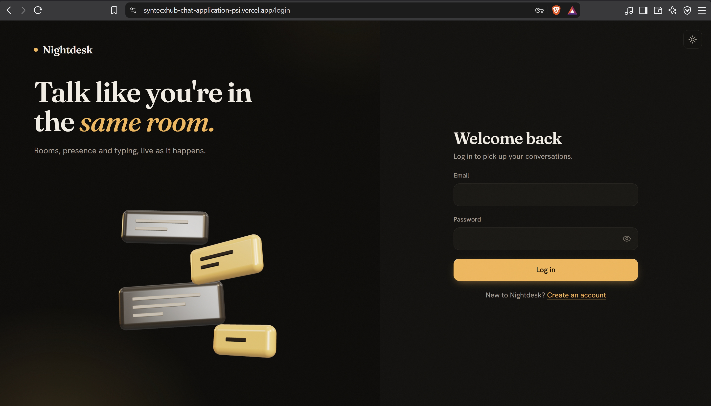
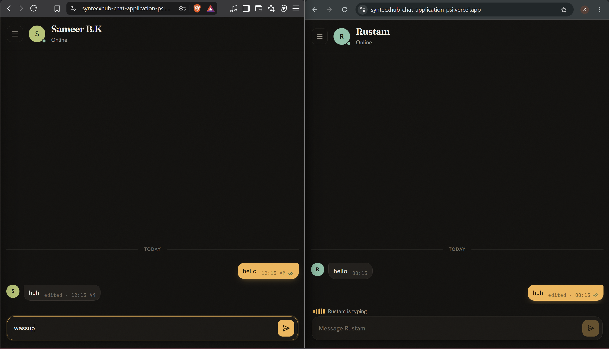
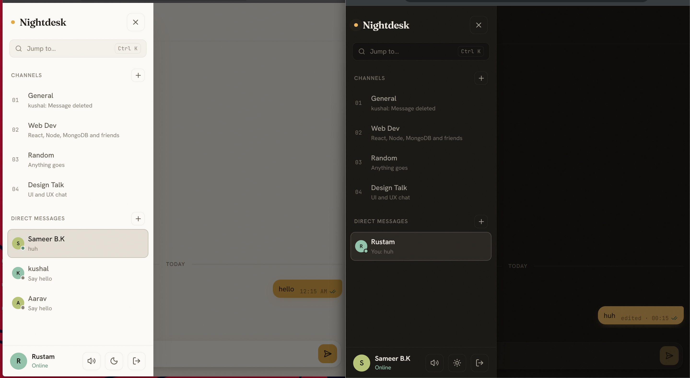

# Nightdesk: Real-Time Chat Application

A full-stack real-time chat app built with the MERN stack and Socket.io for the Syntecxhub Web Development internship (Task 4, Project 3).

**Live demo:** https://syntecxhub-chat-application-psi.vercel.app
**API health check:**https://syntecxhub-chat-server.onrender.com/api/health

> The server runs on a free Render instance, so the first request after inactivity can take up to a minute. To try the chat, open the demo in two windows (one normal, one incognito) and register two accounts.

## Screenshots





## Features

**Chat**
- Real-time messaging with Socket.io, authenticated with JWT
- Public chat rooms, and users can create new ones
- Private direct messages between two users
- Chat history stored in MongoDB
- Typing indicators, online/offline presence, and unread badges
- Read receipts (sent and seen ticks) in direct messages
- Edit your own messages, delete for me, or delete for everyone
- Message sounds with a saved mute setting

**Interface**
- Custom design system, with light and dark themes
- 3D animated login scene built with Three.js, with a fallback for devices without WebGL
- Ctrl+K command palette to jump to any room or person
- Smooth animations that respect the "reduce motion" setting
- Fully responsive layout with a slide-in sidebar on mobile

**Security**
- Passwords hashed with bcrypt, JWT authentication on both REST and WebSocket connections
- Private conversations can only be read by their two members
- Message edits and deletes are checked on the server, so only the sender can change a message
- helmet security headers, rate limiting on login and registration, and per-connection message throttling
- Input validation on both the client and the server

## Tech Stack

- **Frontend:** React (Vite), React Router, Socket.io client, Motion, Three.js, Lucide icons
- **Backend:** Node.js, Express, Socket.io
- **Database:** MongoDB Atlas with Mongoose
- **Auth and security:** JWT, bcryptjs, helmet, express-rate-limit
- **Deployment:** Vercel (client), Render (server), MongoDB Atlas (database)

## How It Works

```
React app (Vercel)  <-- REST + WebSocket -->  Express + Socket.io (Render)  <-->  MongoDB Atlas
```

1. Users register or log in over REST and receive a JWT.
2. The client opens a Socket.io connection and sends the token. The server verifies it before accepting the connection.
3. On connect, the server joins the user to every public room and private chat they belong to.
4. Messages are validated, saved to MongoDB, and broadcast to the room.

## Run Locally

```bash
git clone https://github.com/rustamtimalsina/Syntecxhub_Chat_Application.git
cd Syntecxhub_Chat_Application
```

**Server**
```bash
cd server
npm install
```
Create `server/.env` (see `.env.example`):
```
PORT=5001
MONGO_URI=your_mongodb_connection_string
JWT_SECRET=your_secret_key
CLIENT_URL=http://localhost:5173
```
```bash
npm run dev
```

**Client** (new terminal)
```bash
cd client
npm install
npm run dev
```
Open http://localhost:5173

## REST API

| Method | Endpoint | Auth | Description |
|---|---|---|---|
| POST | /api/auth/register | No | Create an account |
| POST | /api/auth/login | No | Log in and receive a token |
| GET | /api/auth/me | Yes | Current user |
| GET | /api/users?q= | Yes | Search people (name and color only) |
| GET | /api/conversations | Yes | Rooms and my direct messages |
| POST | /api/conversations/channels | Yes | Create a room |
| POST | /api/conversations/dm | Yes | Start or reopen a direct message |
| GET | /api/conversations/:id/messages | Yes | Message history |

## Socket Events

| Event | Direction | Purpose |
|---|---|---|
| message:send, message:new | client to server, server to room | Send and receive messages |
| message:edit, message:delete, message:updated | client to server, server to room | Edit or delete for everyone |
| message:hide, message:hidden | client to server, server to my tabs | Delete for me |
| typing | both | Typing indicator |
| presence:list, presence:update | server to clients | Online users |
| conversation:read | both | Read receipts |
| conversation:created | server to clients | New rooms and chats appear live |

## Author

Rustam Timalsina